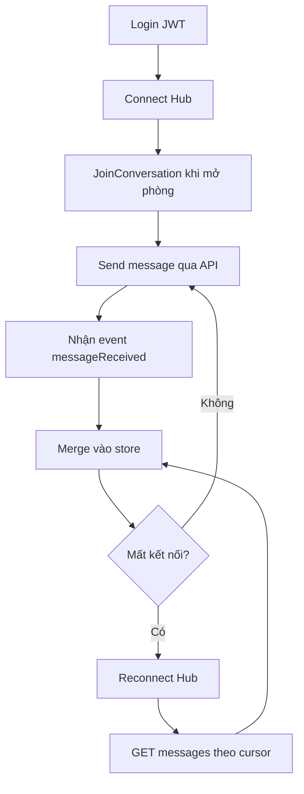
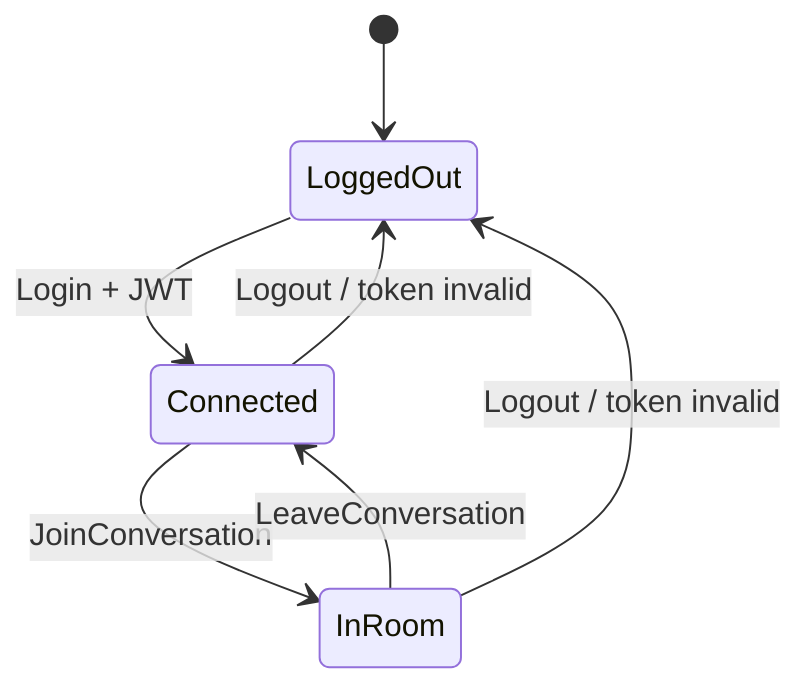
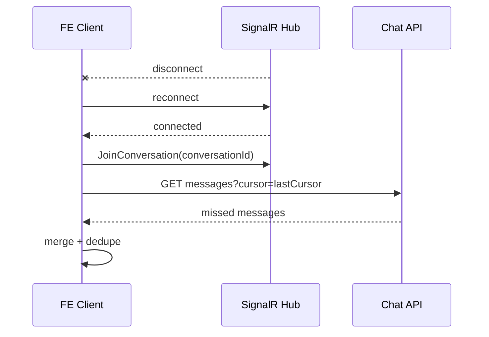

# Chat 1-1 Training Slides

## Từ lý thuyết đến thực tiễn: API + Socket (SignalR)

Trainer: Team Backend
Project: AMKCollective

---

## Slide 1 - Mục tiêu buổi training

1. Hiểu đúng vai trò của API và Socket trong chat 1-1.
2. Biết tại sao đã có Socket vẫn cần API.
3. Biết luồng kết nối giữa Socket Client và API.
4. Implement được reply, reaction, unreact đúng cách.
5. Debug được các case reconnect, mất sự kiện, sai state.

---

## Slide 2 - Vấn đề team thường hỏi

1. Đã có Socket rồi, cần API để làm gì?
2. Socket cũng trả data, sao phải code thêm API?
3. API và Socket khác nhau như thế nào?
4. FE kết nối cả hai bên API + Hub ra sao?

# Chat 1-1 Training Slides (Bản Ngắn Cho FE)

## API + Socket (SignalR) theo kiểu dễ triển khai

---

## Slide 1 - Chốt nhanh 1 câu

1. API để ghi/đọc dữ liệu chuẩn.
2. Socket để nhận cập nhật realtime.
3. FE phải dùng cả hai để chat ổn định.

---

## Slide 2 - FE làm theo đúng thứ tự này

1. Login lấy JWT.
2. Connect Socket với token.
3. Mở phòng chat thì JoinConversation.
4. Send message qua API.
5. Nhận messageReceived từ Socket để render realtime.
6. Reconnect thì gọi API lấy phần thiếu rồi merge state.



---

## Slide 3 - API nào gọi lúc nào?

1. Vào màn danh sách chat:

- GET /api/v1/chat/conversations

2. Mở 1 phòng chat:

- GET /api/v1/chat/conversations/{conversationId}/messages
- Hub invoke: JoinConversation(conversationId)

3. Gửi tin nhắn:

- POST /api/v1/chat/messages

4. Đánh dấu đã đọc:

- POST /api/v1/chat/conversations/{conversationId}/read

5. React hoặc unreact:

- PUT /api/v1/chat/conversations/{conversationId}/messages/{messageId}/reaction
- reaction != null là react, reaction = null là unreact

---

## Slide 4 - Khi nào mở/đóng Socket?

Mở kết nối:

1. Sau login có JWT.
2. Khi app cần realtime.

Đóng kết nối:

1. Khi logout.
2. Token hết hạn không refresh được.
3. User thoát app.

Giữ kết nối nhưng rời room:

1. Rời màn chat hiện tại thì LeaveConversation.
2. Chuyển phòng chat thì leave room cũ, join room mới.



---

## Slide 5 - Reply, Reaction, Unreact

1. Reply dùng chung API gửi tin nhắn:

- POST /api/v1/chat/messages với parentMessageId

2. Reaction và unreact dùng chung 1 API:

- PUT /reaction
- reaction = null nghĩa là unreact

3. FE lắng nghe thêm event:

- messageReceived
- reactionChanged
- readReceipt
- typingChanged

---

## Slide 6 - Reconnect không mất tin nhắn

1. Socket reconnect xong thì join lại room.
2. Gọi API messages với cursor cuối cùng đã sync.
3. Merge + dedupe theo messageId.



---

## Slide 7 - Checklist FE trước khi bàn giao

1. Có cơ chế connect/reconnect Socket.
2. Có join/leave room đúng ngữ cảnh màn hình.
3. Send message bằng API, không phụ thuộc duy nhất vào socket invoke.
4. Có API resync sau reconnect.
5. Có dedupe theo messageId.

---

## Slide 8 - Snippet FE mẫu

```ts
await chatHub.connect(jwt);
await chatHub.joinConversation(conversationId);

chatHub.onMessageReceived((msg) => store.mergeMessage(msg));

await chatApi.sendMessage({
  conversationId,
  content: "hello",
  parentMessageId: null,
});

chatHub.onReconnected(async () => {
  await chatHub.joinConversation(conversationId);
  const missed = await chatApi.getMessages(conversationId, {
    cursor: store.lastCursor,
  });
  store.mergeMessages(missed.items);
});
```

---

## Tài liệu liên quan

1. CHAT_SOCKET_API_TRAINING_FAQ.md
2. CHAT_MANUAL_TEST_GUIDE.md
3. GUIDELINE_SOCKET.md
4. 0 = Like
